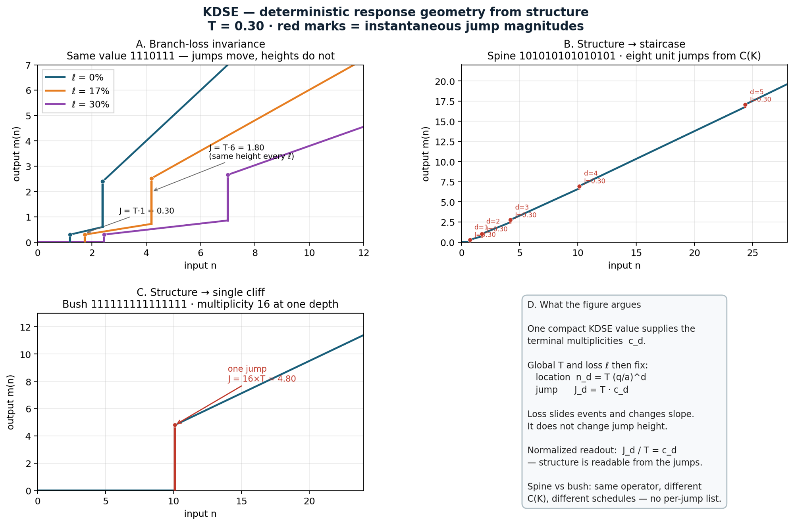
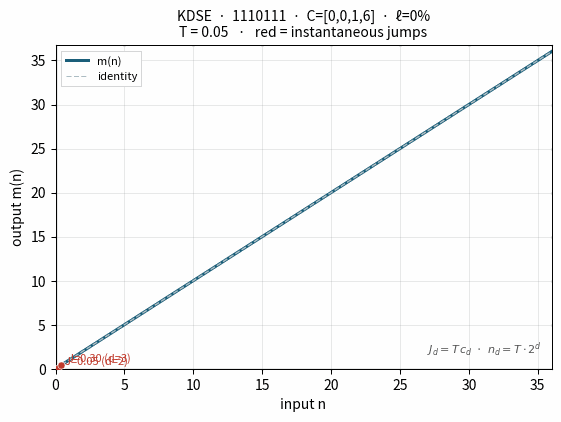

<!--
Copyright (C) 2026 Mark Karaman
SPDX-License-Identifier: CC-BY-SA-4.0
Source-code samples in this file: AGPL-3.0-or-later
-->

# KDSE — KDSE-8 and KDSE-16

**Status: Archived / read-only (v1.0)**  
This repository is currently archived and read-only. Issues and pull requests are not accepted at this time.

**K — Dendritic Structural Encoding (KDSE)** is a compact, delimiterless encoding of finite full binary trees (a special case of full *q*-ary dendrites), with Ordered canonical forms, terminal-depth profiles, and a deterministic threshold-and-loss operator. The mathematical specification is language-independent; see the companion papers.

This repository provides a **portable ISO C11 reference implementation** of the **KDSE-8** and **KDSE-16** container forms—checked admission, trusted compute paths, CLI tools, examples, and exhaustive tests.

| Container | Payload | Unassigned bit | Valid payload lengths |
|-----------|---------|----------------|-----------------------|
| KDSE-8    | bits 0–6 | bit 7, ignored | 1, 3, 5, 7 |
| KDSE-16   | bits 0–14 | bit 15, ignored | 1, 3, 5, …, 15 |

In either payload, `1` means branch and `0` means terminal. Levels are serialized breadth-first; the number of branches at one level determines the width of the next, and the final all-terminal level is implicit.

## Papers

The mathematical definitions and theorems are given in the accompanying papers (CC BY-SA 4.0):

- [Introductory paper](docs/papers/KDSE_Introductory_Paper.pdf) — structural encoding, attributes, Ordered form, and operator separation.
- [Instantaneous Jump Magnitude paper](docs/papers/KDSE_Deterministic_Instantaneous_Jump_Magnitude.pdf) — threshold-and-loss operator and the IJM identity \(J_d = T\,c_d\).

U.S. Patent Pending — Application No. 64/131,240.

## Response geometry

Compact KDSE structure determines a deterministic jump schedule under the threshold-and-loss operator. Jump heights follow \(J_d = T\,c_d\); branch loss moves locations without changing those heights.



*Structure determines the jump schedule: loss moves locations; heights stay \(J_d = T\,c_d\).*



*Payload `1110111` threshold sweep ( ℓ = 0%): jumps grow and move as \(T\) increases.*

## Quick start

```sh
make
make test

build/bin/kdse validate 0b101
build/bin/kdse profile 0b1110111
build/bin/kdse canonicalize 0b110
build/bin/kdse compute 0b1110111 \
  --input 5 --threshold 0.3 --loss-percent 17

build/bin/kdse16 validate 0x5555
build/bin/kdse16 profile 0b101010101010101
build/bin/kdse16 compute 0x7fff \
  --input 100 --threshold 1 --loss-percent 0
```

The KDSE-8 compute command prints `3.00532625`; the KDSE-16 compute command prints `100`.

## Two paths, four separate libraries

| Library | Purpose | Input trust |
|---------|---------|-------------|
| `libkdse8_checked.a` | Extract, validate, decode profiles, and canonicalize KDSE-8 | Untrusted or not-yet-admitted bytes |
| `libkdse8_compute.a` | Thresholded equal-split computation with branch loss | KDSE-8 already validated by the caller |
| `libkdse16_checked.a` | Extract, validate, decode profiles, and canonicalize KDSE-16 | Untrusted or not-yet-admitted words |
| `libkdse16_compute.a` | Thresholded equal-split computation with branch loss | KDSE-16 already validated by the caller |

The streamlined compute function does not validate, canonicalize, assert validity, or recover from malformed KDSE. Its mandatory precondition is:

> **The supplied KDSE value must already be valid for its container width.**

Ordered form is not required. Every valid KDSE-8 or KDSE-16 payload is structurally complete and finishes computation. Ordered form provides canonical identity among sibling permutations; it is not a completion condition.

## Minimal C example

```c
#include "kdse/kdse8_checked.h"
#include "kdse/kdse8_compute.h"

kdse8_t kdse = 0x77; /* payload 1110111 */

if (kdse8_validate(kdse) == KDSE_STATUS_OK) {
    double output = kdse8_compute(kdse, 5.0, 0.30, 0.17);
}
```

The C API expresses branch loss as a fraction in `[0, 1)`. The CLI accepts a percentage in `[0, 100)` and converts it before invoking the compute library. KDSE-16 follows the same call sequence with the `kdse16_*` API.

## Repository map

- `include/kdse/` — public headers and complete function contracts.
- `src/` — checked-boundary and streamlined-compute implementations.
- `cli/` — `kdse` for KDSE-8 and `kdse16` for KDSE-16.
- `examples/` — minimal compute and canonicalization programs for both widths.
- `tests/` — exhaustive validation, canonicalization, compute, and CLI tests.
- `docs/API.md` — concise public API catalog.
- `docs/KDSE-8.md` — representation, validity, Ordered form, and operator definition.
- `docs/KDSE-16.md` — the corresponding 16-bit representation and limits.
- `docs/catalog-8bit.md` — all 38 valid payloads grouped under 13 Ordered forms.
- `docs/papers/` — the introductory and Instantaneous Jump Magnitude papers.

See [INSTALL.md](INSTALL.md) for build and installation details.

## Licensing

| Material | License |
|----------|---------|
| C source, headers, build files, tests, examples, CLI, and source-code samples | **AGPL-3.0-or-later** |
| Markdown documentation and the supplied papers | **CC BY-SA 4.0** |

Source-code samples embedded in Markdown remain AGPL-3.0-or-later. See [LICENSE.md](LICENSE.md) and the files under `LICENSES/`.

**Commercial licensing** is available for parties who prefer not to use the AGPL or who require rights beyond those granted by the pending patent and the open-source licenses.

- Commercial licensing: [licensing@uhware.com](mailto:licensing@uhware.com)
- Security reports: [security@uhware.com](mailto:security@uhware.com)

U.S. Patent Pending — Application No. 64/131,240.

## Disclaimer

This software and the accompanying papers are provided “as is”, without warranty of any kind, express or implied, including but not limited to the warranties of merchantability, fitness for a particular purpose, and noninfringement. In no event shall the authors be liable for any claim, damages, or other liability arising from the use of these materials. Nothing in this repository constitutes legal advice regarding patent rights or license obligations.
