<!--
Copyright (C) 2026 Mark Karaman
SPDX-License-Identifier: CC-BY-SA-4.0
-->

# KDSE-8 Catalog

The complete **KDSE-8** study space — the binary container class
`KDSE[2,7;8,2]`: minimal-form payloads of length 1, 3, 5, or 7 (valid
lengths are always odd), right-aligned in one byte with one reserved
bit; the byte value is the payload value. The space contains **38
valid payloads**, which collapse to the **13 Ordered forms** below
(lowest-numerical synonym, per the spec), inducing **12 Raw Scalar
response families** (terminal-depth profiles) and **8 Normalized
Shape classes** (profiles up to depth shift).

Conventions: `levels` shows the self-derived level partition. The
profile entry `c[d]` counts leaves at depth d, implicit leaves
included; Kraft: sum c[d]/2^d = 1 always. The gain schedule lists, per
populated depth, the activation input (as a multiple of threshold T)
and the gain step; steps always total 1. `synonyms` lists every valid
payload of the same unordered shape. Branch nodes are circles,
terminals are squares.

| # | payload | dec | bits | profile | family | shape | synonyms |
|---|---|---|---|---|---|---|---|
| 1 | `0` | 0 | 1 | [1] | F1 | S1 | 1 |
| 2 | `1` | 1 | 1 | [0, 2] | F2 | S1 | 1 |
| 3 | `101` | 5 | 3 | [0, 1, 2] | F3 | S2 | 2 |
| 4 | `111` | 7 | 3 | [0, 0, 4] | F4 | S1 | 1 |
| 5 | `10101` | 21 | 5 | [0, 1, 1, 2] | F5 | S3 | 4 |
| 6 | `10111` | 23 | 5 | [0, 1, 0, 4] | F6 | S4 | 2 |
| 7 | `1010101` | 85 | 7 | [0, 1, 1, 1, 2] | F7 | S5 | 8 |
| 8 | `1010111` | 87 | 7 | [0, 1, 1, 0, 4] | F8 | S6 | 4 |
| 9 | `1110001` | 113 | 7 | [0, 0, 3, 2] | F9 | S7 | 4 |
| 10 | `1110011` | 115 | 7 | [0, 0, 2, 4] | F10 | S2 | 2 |
| 11 | `1110101` | 117 | 7 | [0, 0, 2, 4] | F10 | S2 | 4 |
| 12 | `1110111` | 119 | 7 | [0, 0, 1, 6] | F11 | S8 | 4 |
| 13 | `1111111` | 127 | 7 | [0, 0, 0, 8] | F12 | S1 | 1 |

The single profile collision (two canonical forms, one response):
**F10** is shared by `1110011` and `1110101` (profile [0, 0, 2, 4]) — the only redundancy in the space; 13 forms, 12 distinct responses.

---

## 1. `0`

decimal **0** · 1 bit · levels `0` · 0 branches, 1 leaf · max depth 0 · family F1 · shape S1

synonyms (1): `0`

gain schedule: n ≥ T: +1 → 1

## 2. `1`

decimal **1** · 1 bit · levels `1` · 1 branch, 2 leaves · max depth 1 · family F2 · shape S1

synonyms (1): `1`

gain schedule: n ≥ 2T: +1 → 1

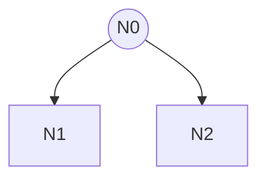

## 3. `101`

decimal **5** · 3 bits · levels `1 | 01` · 2 branches, 3 leaves · max depth 2 · family F3 · shape S2

synonyms (2): `101`, `110`

gain schedule: n ≥ 2T: +1/2 → 1/2; n ≥ 4T: +1/2 → 1

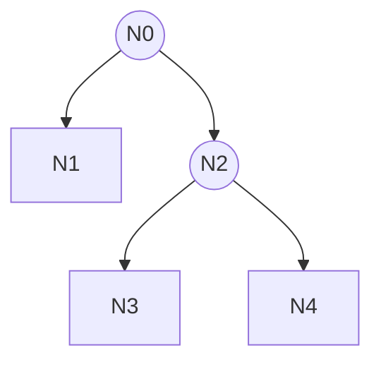

## 4. `111`

decimal **7** · 3 bits · levels `1 | 11` · 3 branches, 4 leaves · max depth 2 · family F4 · shape S1

synonyms (1): `111`

gain schedule: n ≥ 4T: +1 → 1

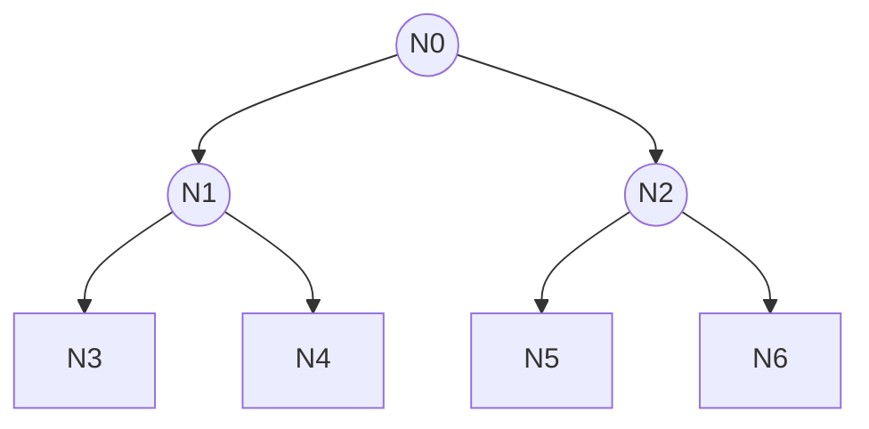

## 5. `10101`

decimal **21** · 5 bits · levels `1 | 01 | 01` · 3 branches, 4 leaves · max depth 3 · family F5 · shape S3

synonyms (4): `10101`, `10110`, `11001`, `11010`

gain schedule: n ≥ 2T: +1/2 → 1/2; n ≥ 4T: +1/4 → 3/4; n ≥ 8T: +1/4 → 1

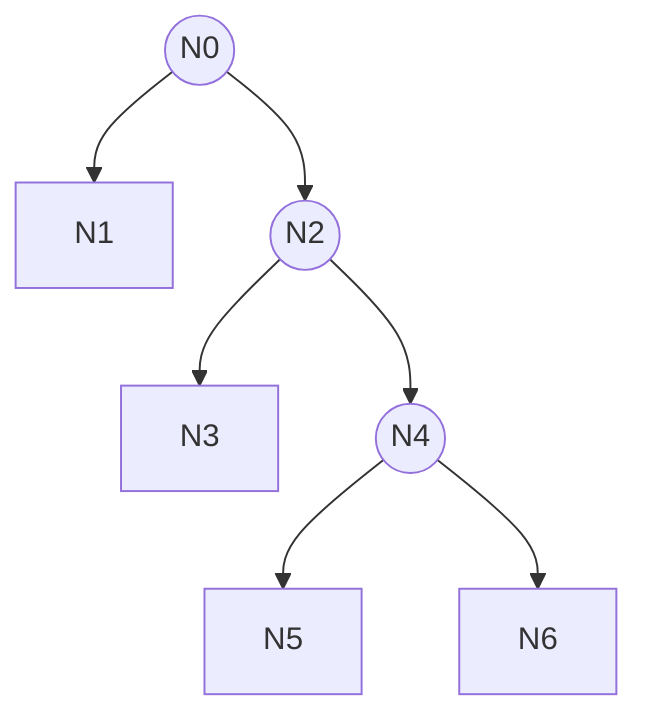

## 6. `10111`

decimal **23** · 5 bits · levels `1 | 01 | 11` · 4 branches, 5 leaves · max depth 3 · family F6 · shape S4

synonyms (2): `10111`, `11011`

gain schedule: n ≥ 2T: +1/2 → 1/2; n ≥ 8T: +1/2 → 1

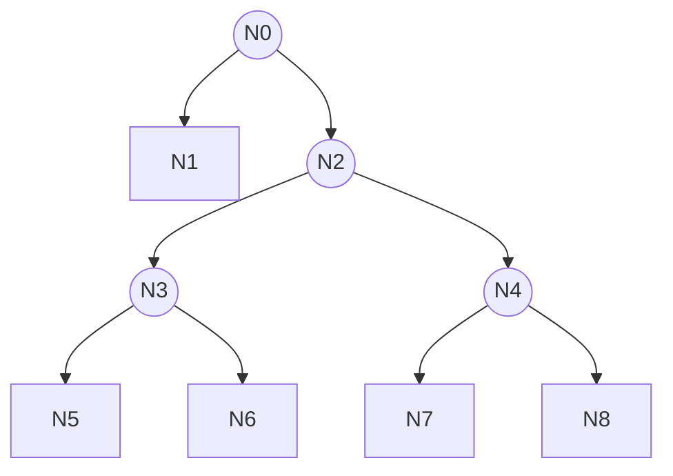

## 7. `1010101`

decimal **85** · 7 bits · levels `1 | 01 | 01 | 01` · 4 branches, 5 leaves · max depth 4 · family F7 · shape S5

synonyms (8): `1010101`, `1010110`, `1011001`, `1011010`, `1100101`, `1100110`, `1101001`, `1101010`

gain schedule: n ≥ 2T: +1/2 → 1/2; n ≥ 4T: +1/4 → 3/4; n ≥ 8T: +1/8 → 7/8; n ≥ 16T: +1/8 → 1

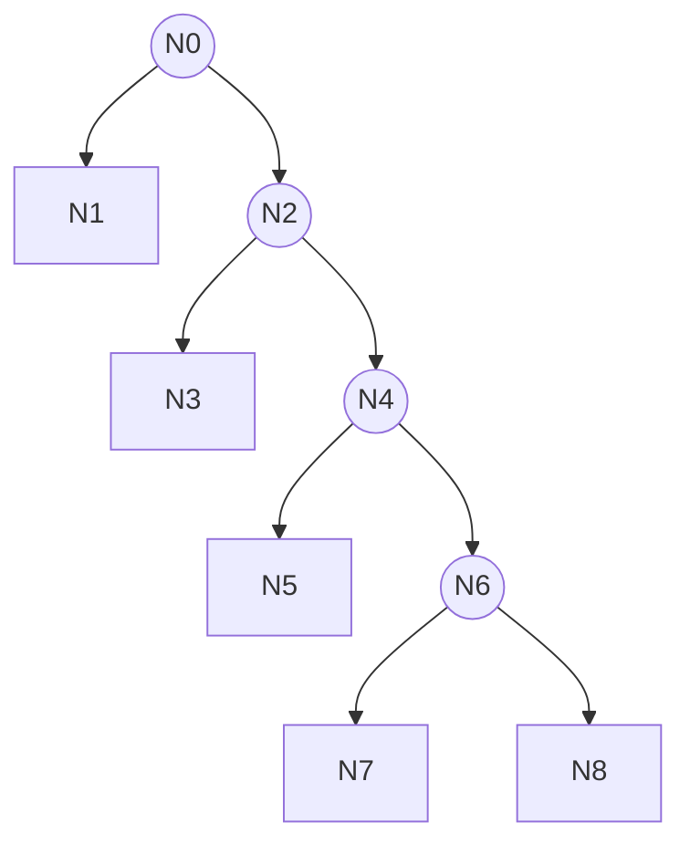

## 8. `1010111`

decimal **87** · 7 bits · levels `1 | 01 | 01 | 11` · 5 branches, 6 leaves · max depth 4 · family F8 · shape S6

synonyms (4): `1010111`, `1011011`, `1100111`, `1101011`

gain schedule: n ≥ 2T: +1/2 → 1/2; n ≥ 4T: +1/4 → 3/4; n ≥ 16T: +1/4 → 1

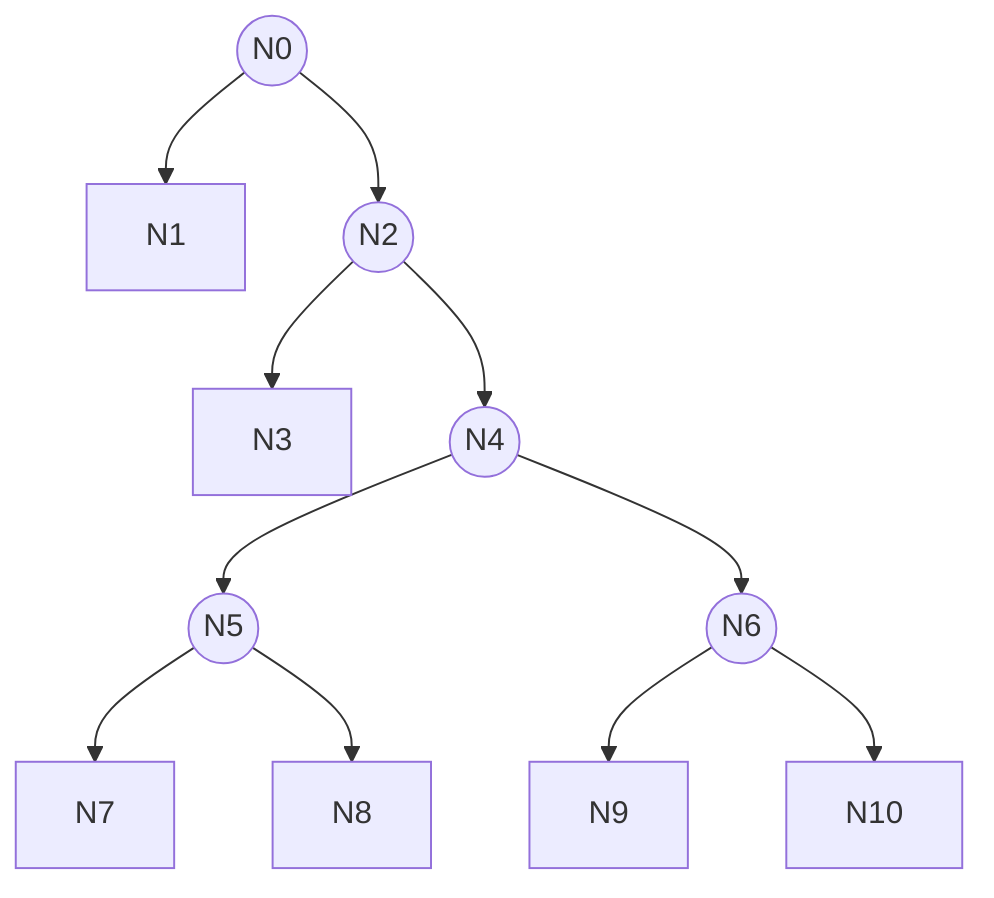

## 9. `1110001`

decimal **113** · 7 bits · levels `1 | 11 | 0001` · 4 branches, 5 leaves · max depth 3 · family F9 · shape S7

synonyms (4): `1110001`, `1110010`, `1110100`, `1111000`

gain schedule: n ≥ 4T: +3/4 → 3/4; n ≥ 8T: +1/4 → 1

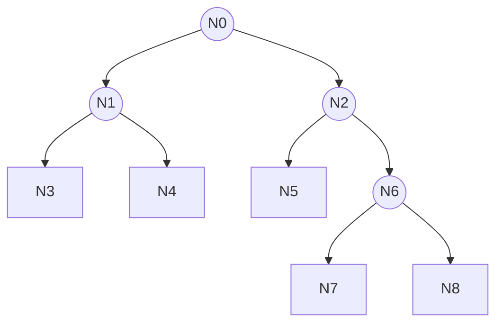

## 10. `1110011`

decimal **115** · 7 bits · levels `1 | 11 | 0011` · 5 branches, 6 leaves · max depth 3 · family F10 · shape S2

synonyms (2): `1110011`, `1111100`

gain schedule: n ≥ 4T: +1/2 → 1/2; n ≥ 8T: +1/2 → 1

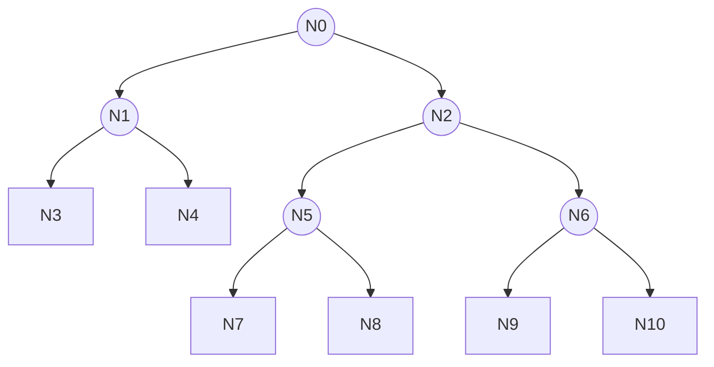

## 11. `1110101`

decimal **117** · 7 bits · levels `1 | 11 | 0101` · 5 branches, 6 leaves · max depth 3 · family F10 · shape S2

synonyms (4): `1110101`, `1110110`, `1111001`, `1111010`

gain schedule: n ≥ 4T: +1/2 → 1/2; n ≥ 8T: +1/2 → 1

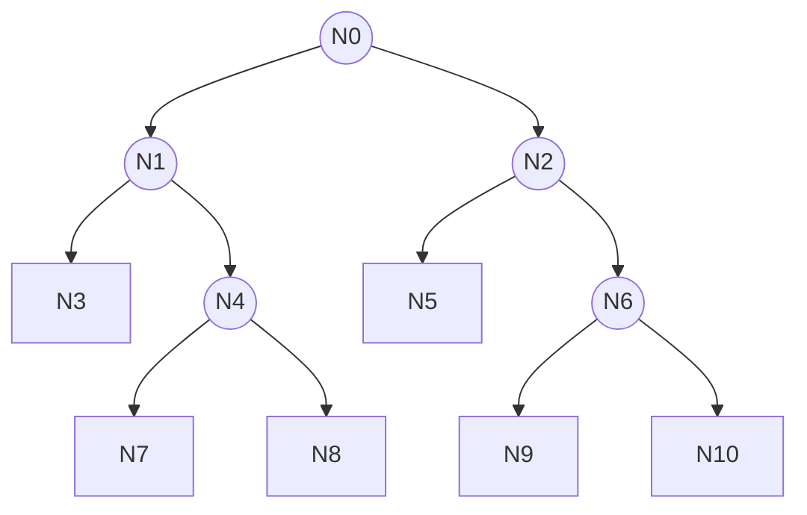

## 12. `1110111`

decimal **119** · 7 bits · levels `1 | 11 | 0111` · 6 branches, 7 leaves · max depth 3 · family F11 · shape S8

synonyms (4): `1110111`, `1111011`, `1111101`, `1111110`

gain schedule: n ≥ 4T: +1/4 → 1/4; n ≥ 8T: +3/4 → 1

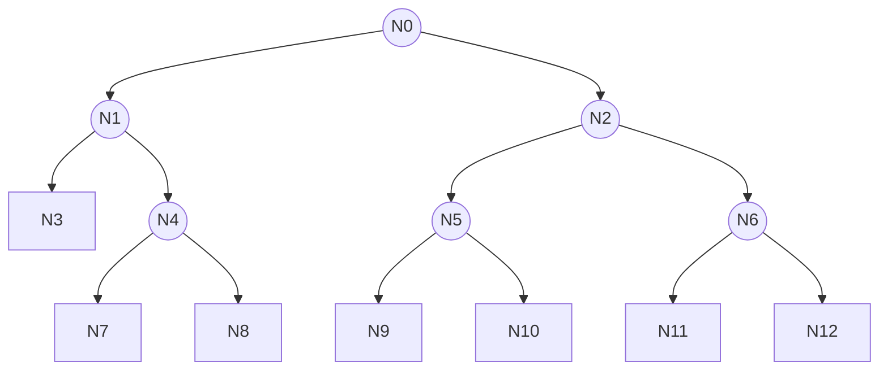

## 13. `1111111`

decimal **127** · 7 bits · levels `1 | 11 | 1111` · 7 branches, 8 leaves · max depth 3 · family F12 · shape S1

synonyms (1): `1111111`

gain schedule: n ≥ 8T: +1 → 1

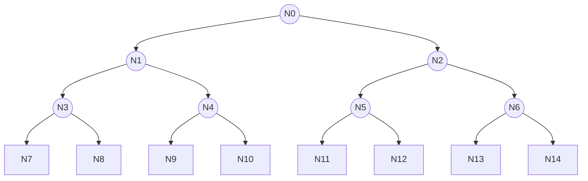

---

---

*Copyright © 2026 Mark Karaman · Documentation: CC BY-SA 4.0 · Source samples: AGPL-3.0-or-later*  
*U.S. Patent Pending — Application No. 64/131,240*  
*Commercial licensing: licensing@uhware.com · Security: security@uhware.com*  
*Companion papers: see [docs/papers/](papers/).*
